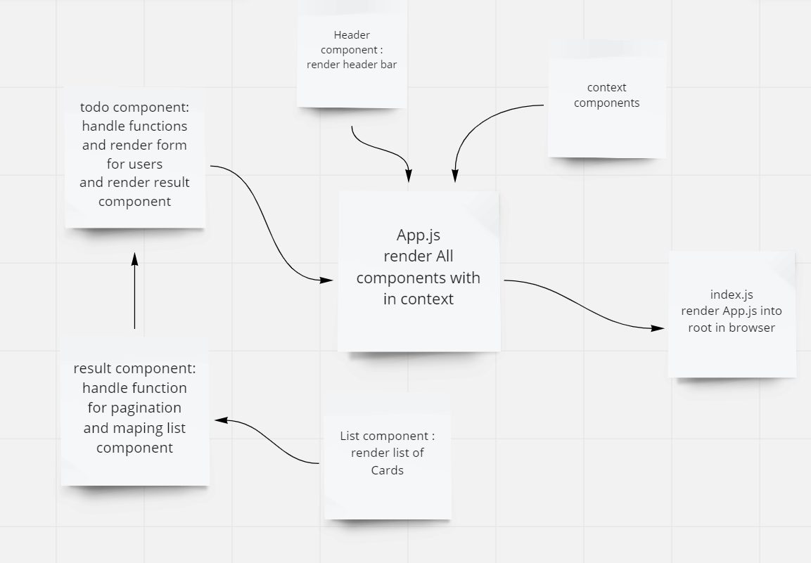

# Description
Creat application allow user enter data in form this data about activity and check if him do that activity or not

the base of todo app.
 - a user can add a new task
 - a user can assign that task to name
 - a user can sort the task by name or by completetion
 - a user can delete the task
 -a user is can display only the incompleted tasks

# UML

# Links
- [Netlify Link](https://stunning-cobbler-57f80b.netlify.app//)
- [PR6]([https://github.com/WalidAlrefai/todo-app/pull/3](https://github.com/WalidAlrefai/todo-app/pull/6))
