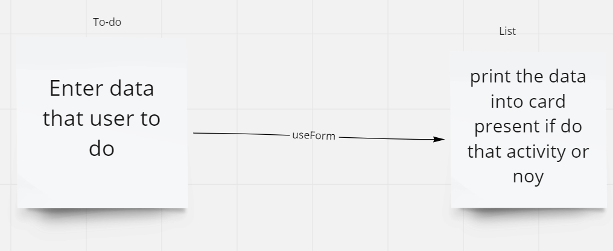

# Description
Creat application allow user enter data in form this data about activity and check if him do that activity or not

# UML

# Links
- [Netlify Link](https://628246bc156c5d00090c59ee--stunning-cobbler-57f80b.netlify.app/)
- -[Last PR](https://github.com/WalidAlrefai/todo-app/pull/3)
